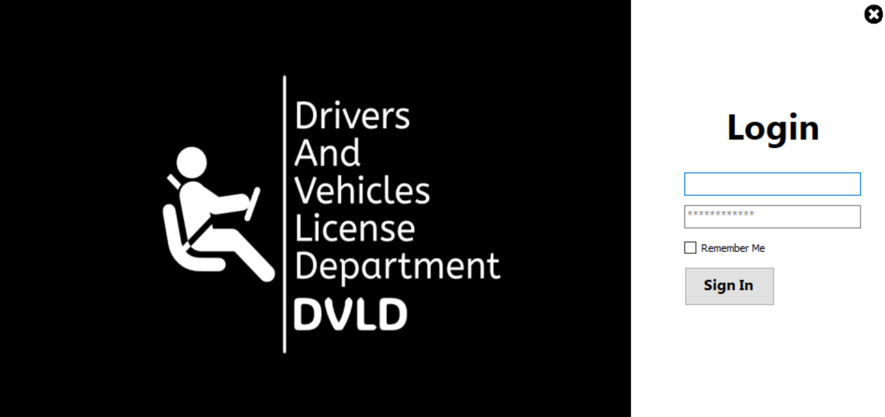
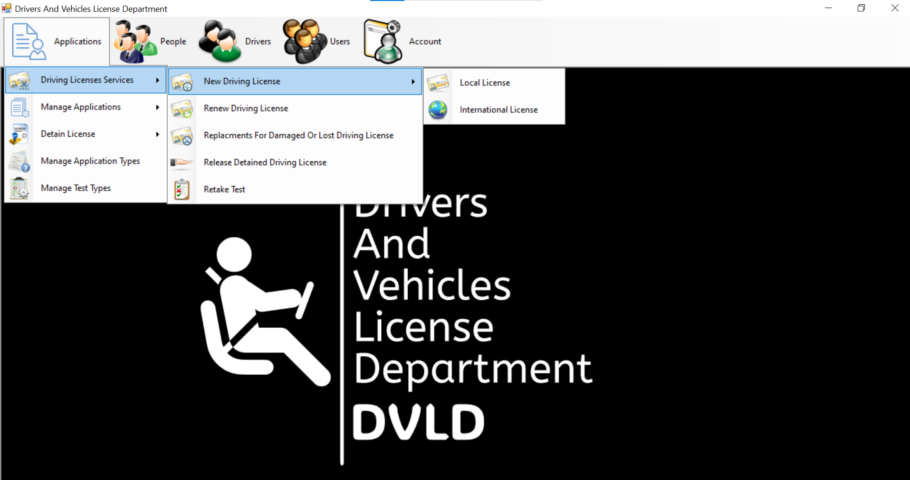
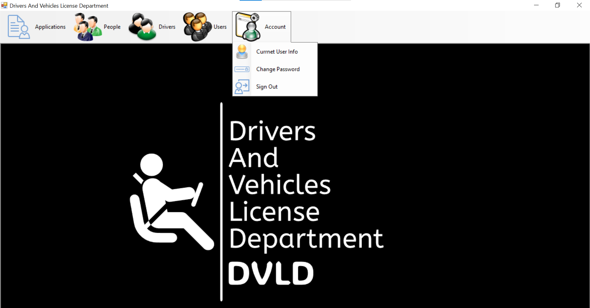
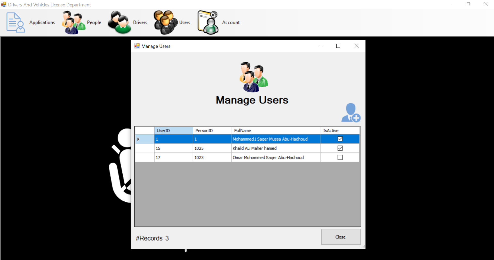
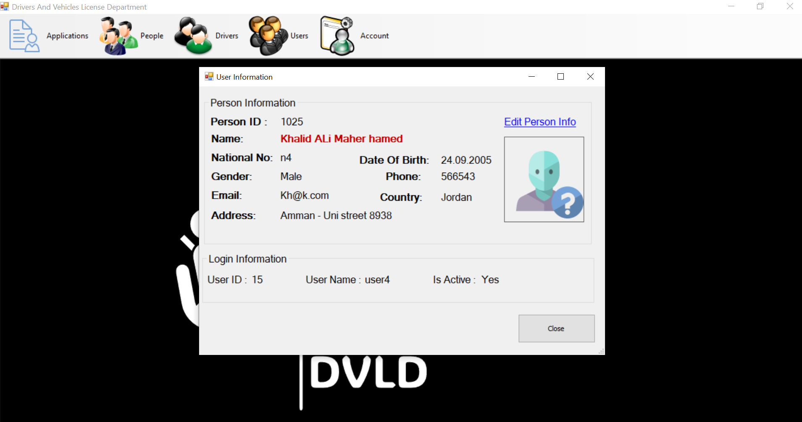

# Drivers & Vehicle License Department (DVLD)

## Overview

The Driving & Vehicle License Management System (DVLD) is designed to streamline the process of issuing and managing driver licenses and related services.

## Project Status

This project is currently under active development. Certain features may be incomplete or undergoing changes.

## Some Screenshots

